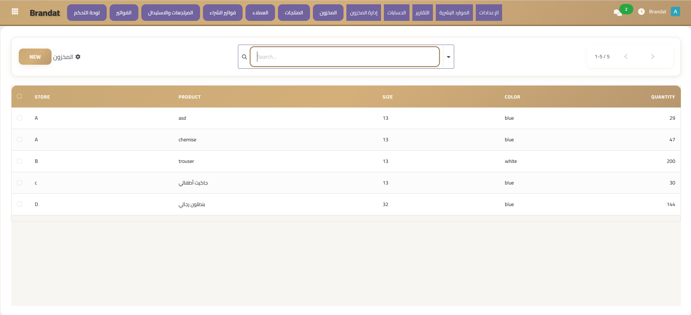

A comprehensive ERP solution specifically designed for clothing and fashion retail management. Built on Odoo 18 with full Arabic localization.

## 📋 Table of Contents

- [Features](#-features)
- [Screenshots](#-screenshots)
- [Installation](#-installation)
- [Module Structure](#-module-structure)
- [Usage](#-usage)
- [Configuration](#-configuration)
- [Contributing](#-contributing)
- [License](#-license)
- [Contact](#-contact)

## ✨ Features

### 📊 Smart Dashboard
- Real-time sales tracking (daily, weekly, monthly)
- Sales growth analytics
- Customer base monitoring
- Low stock and out-of-stock alerts
- Quick action buttons for common tasks

### 💰 Financial Management
- **Treasury Management**: Complete cash flow tracking
- **Payment System**: Customer and supplier payments
- **Expense Management**: Categorized expense tracking
- **Financial Reports**: Comprehensive accounting reports
- **Transaction Tracking**: Detailed audit trail

### 📦 Inventory Management
- Multi-variant product tracking (size, color)
- Inter-branch stock transfers
- Automated inventory counting
- Stock alerts and notifications
- Minimum stock level management
- Real-time stock status (Available, Low, Out of Stock)

### 🛍️ Sales & POS
- Professional invoice generation
- Multiple discount types (percentage/fixed)
- Customer loyalty points system
- Invoice printing with custom templates
- Email and WhatsApp invoice delivery
- Multi-branch support

### 🔄 Returns & Exchange
- Flexible return policies (configurable days)
- Return and exchange operations
- Return reason tracking
- Automatic stock adjustment
- Exchange difference calculation

### 👥 Customer Management
- Customer profiles with purchase history
- Loyalty points system
- Customer type classification (Regular, VIP, Wholesale)
- Automatic discount application
- Customer segmentation

### 👨‍💼 Employee & HR
- Employee profiles and management
- Sales commission tracking
- Attendance and time tracking
- Performance analytics
- Role-based access control

### 📈 Reports & Analytics
- Sales reports with charts
- Inventory reports
- Top products analysis
- Branch performance comparison
- Financial reports
- Custom report wizard

### 🏢 Multi-Branch Support
- Manage multiple stores
- Inter-branch transfers
- Branch-specific reports
- Centralized inventory view

## 📸 Screenshots

### Dashboard


### Sales Invoice


### Inventory Management


## 🚀 Installation

### Prerequisites

- Odoo 17.0
- Python 3.10+
- PostgreSQL 12+

### Steps

1. **Clone the repository**
```bash
git clone https://github.com/yourusername/brandat-erp.git
cd brandat-erp
```

2. **Copy to Odoo addons directory**
```bash
cp -r brandat_* /path/to/odoo/addons/
```

3. **Update Odoo addons list**
```bash
odoo-bin -c /path/to/odoo.conf -u all --stop-after-init
```

4. **Restart Odoo**
```bash
sudo systemctl restart odoo
```

5. **Install the module**
- Go to Apps
- Search for "Brandat"
- Click Install

## 📁 Module Structure

```
brandat_product/
├── __init__.py
├── __manifest__.py
├── models/
│   ├── __init__.py
│   ├── store.py
│   ├── product.py
│   ├── size.py
│   ├── color.py
│   ├── stock.py
│   ├── sale.py
│   ├── sale_line.py
│   ├── sale_return.py
│   ├── partner.py
│   ├── employee.py
│   ├── treasury.py
│   ├── transaction.py
│   ├── payment.py
│   ├── expense.py
│   ├── dashboard.py
│   ├── report.py
│   ├── stock_advanced.py
│   └── account_report.py
├── views/
│   ├── menu.xml
│   ├── store_view.xml
│   ├── product_view.xml
│   ├── size_view.xml
│   ├── color_view.xml
│   ├── stock_view.xml
│   ├── sale_view.xml
│   ├── sale_return_view.xml
│   ├── partner_view.xml
│   ├── employee_view.xml
│   ├── treasury_view.xml
│   ├── transaction_view.xml
│   ├── payment_view.xml
│   ├── expense_view.xml
│   ├── dashboard_view.xml
│   ├── report_view.xml
│   ├── stock_advanced_view.xml
│   ├── account_report_view.xml
│   └── company_settings_view.xml
├── reports/
│   ├── sale_report.xml
│   └── sale_report_template.xml
├── security/
│   ├── ir.model.access.csv
│   └── security.xml
├── data/
│   ├── sequence.xml
│   └── company_settings_data.xml
└── static/
    ├── description/
    │   ├── icon.png
    │   └── index.html
    └── src/
        ├── css/
        └── js/
```

## 💻 Usage

### Creating a Sale

1. Navigate to **Brandat > Sales > Invoices**
2. Click **Create**
3. Select store, employee, and customer
4. Add products with size and color
5. Apply discounts if needed
6. Confirm the invoice
7. Print or send via email/WhatsApp

### Managing Inventory

1. Go to **Brandat > Inventory**
2. View current stock levels
3. Set minimum stock alerts
4. Create stock transfers between branches
5. Perform inventory counts

### Processing Returns

1. Navigate to **Brandat > Returns & Exchange**
2. Select the original sale
3. Choose products to return
4. Select return or exchange
5. For exchange, add replacement products
6. Approve and complete

### Viewing Reports

1. Go to **Brandat > Reports**
2. Select report type (Sales, Inventory, Financial)
3. Set date range and filters
4. Generate report
5. Export to PDF/Excel

## ⚙️ Configuration

### Company Settings

Configure company information:
- Company name (Arabic & English)
- Tax number and commercial registration
- Contact information
- Logo and stamp
- Invoice footer
- Terms and conditions

### Return Policy

Set return policy days in configuration (default: 7 days)

### Stock Alerts

Configure minimum stock levels per product/store

### User Permissions

Assign roles and permissions:
- Admin: Full access
- Store Manager: Store-specific access
- Cashier: Sales and returns only
- Accountant: Financial access

## 🛠️ Technical Details

### Technologies Used

- **Framework**: Odoo 18.0
- **Language**: Python 3.10+
- **Database**: PostgreSQL
- **Frontend**: XML, QWeb, JavaScript
- **Styling**: Bootstrap, Custom CSS

### Key Models

- `brandat.store`: Store/Branch management
- `brandat.product`: Product catalog
- `brandat.stock`: Inventory tracking
- `brandat.sale`: Sales orders
- `brandat.sale.return`: Return operations
- `brandat.customer`: Customer management
- `brandat.employee`: HR management
- `brandat.treasury`: Cash management
- `brandat.transaction`: Financial transactions

### API Endpoints

All standard Odoo REST API endpoints are available.


